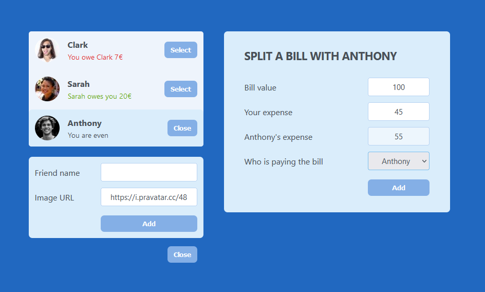

# React - Split the bill

# 🔗 [Live Preview]()

---

## About 👋

Split the bill is a React application designed to manage a list of friends, allowing users to add new friends, select friends, and split bills among them. This project demonstrates the use of React hooks and components to build a dynamic and interactive user interface.

Everything is stuffed in `App.js` on purpose as this was a practice project on how props flow, and lifting state.

---

## Features 👨‍💻

- **Add New Friends:** Users can add new friends with a name and an optional image URL.

- **Select Friends:** Users can select a friend from the list to view their balance or split a bill.

- **Split Bills:** Users can split bills with selected friends, updating the balance accordingly.

- **Interactive UI:** The application features a user-friendly interface with dynamic updates and conditional rendering.

---

## Components ⚙️

- App: The main component managing the state and rendering the UI.

- Button: A reusable button component.

- FriendsList: A component displaying the list of friends.

- Friend: A component representing a single friend in the list.

- FormAddFriend: A form component for adding new friends.

- FormSplitBill: A form component for splitting bills with a selected friend.

---

## Languages

- React: functions, conditionals, useState, components, props, derived state
- Styling: basic
